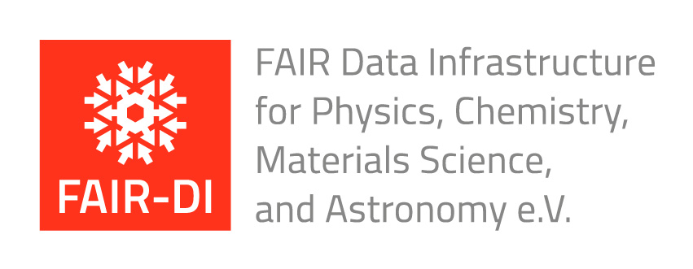

# Organisation

## Chairs

[**Arjen P. de Vries**][arjen] is professor of Information Retrieval at the Institute of Computing and Information Sciences (iCIS) of Radboud University in Nijmegen, The Netherlands.

[**Thom Palstra**][thom] is professor of Solid State Chemistry at the University of Twente in Enschede, The Netherlands.

[**Christof Wöll**][christof] is professor of Physical Chemistry at the Institute of Functional Interfaces (IFG) at the Karlsruher Institut für Technologie (KIT), Germany.

The workshop is organised under the auspices of [FAIR-DI](https://www.fair-di.eu/fair-di/).

[arjen]:    https://www.cs.ru.nl/~arjen/                                                    "About Arjen P. de Vries"
[thom]:     https://www.utwente.nl/en/research/researchers/featured-scientists/palstra/     "About Thom Palstra"
[christof]: https://www.ifg.kit.edu/english/277_264.php                                     "About Christof Wöll"
